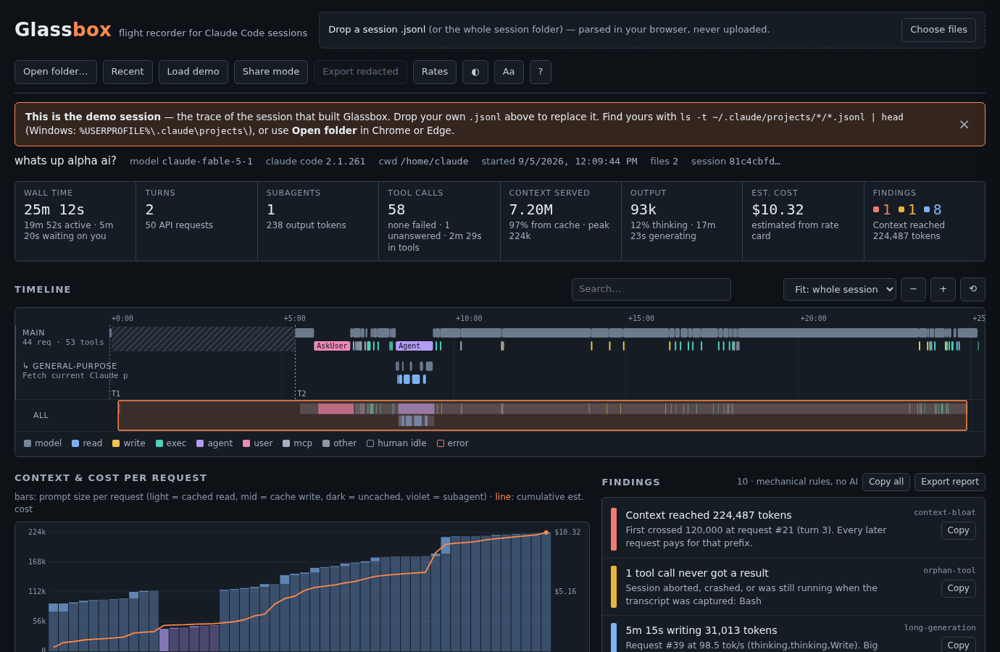

# Glassbox

[](https://github.com/aldohushi1-stack/glassbox/actions/workflows/ci.yml)

**Other tools show you what happened in a Claude Code session. Glassbox tells you what went wrong.**

Drop a session `.jsonl` onto one HTML file. Get a timeline of every model call and tool call — subagents and Workflow agents included — where the tokens and money went, and a list of things a reviewer would flag — retry loops, failing tools, oversized results, context that cost you money, files every subagent re-read — each with the evidence and one line on what to do differently. Compare two sessions side by side. Watch one live while Claude Code writes it. Hand the findings back to the agent. Nothing leaves your machine, and no tokens are spent: every rule is mechanical.

**Check an agent run like a test.** `glassbox check --fail-on warn` exits 1 when a session looped, kept failing, or ran up context — so a `claude -p` job in CI can fail the build the way a test would ([docs/CI.md](docs/CI.md)).



The demo built into the file is the trace of the session that built Glassbox, sanitised.

## Why

Every Claude Code and Cowork session writes its full transcript to `~/.claude/projects/<project>/<session-id>.jsonl`, with subagents in `<session-id>/subagents/agent-*.jsonl` and Workflow agents in `<session-id>/subagents/workflows/<runId>/`. The Agent SDK emits the same shapes as `--output-format stream-json`. Those files are the only complete record of what an agent did, and they're unreadable: one JSON object per line, assistant messages split one record per content block, usage duplicated across those records, tool calls joined to results only by id.

Agents can't see their own traces. Humans reviewing agent work can't either. Glassbox fixes both.

## Use it

**Fastest:** `npx glassbox-trace` opens your newest Claude Code session in the browser.

```
npx glassbox-trace                    open the newest session (or `npm i -g glassbox-trace`, then `glassbox …`)
glassbox list --last 10               list sessions (id, time, size, project, title)
glassbox list --grep "npm test"       only sessions containing the text
glassbox open 81c4                    open a session by id prefix (or a .jsonl path)
glassbox open 81c4 --out trace.html   write a self-contained HTML you can send to someone
glassbox check                        print findings; exit 1 on any error-level finding
glassbox check --format md            the findings as Markdown written for the agent: evidence + what to do next time
glassbox check --fail-on warn --format json   stricter, machine-readable (CI, hooks, agents); add --redact before sharing
glassbox compare 81c4 9f0a            same task, two sessions: time, tokens, cost, tools and findings side by side
glassbox compare 81c4 9f0a --out cmp.html     …as one HTML with both sessions in it
glassbox watch                        live tail: the viewer follows the newest session as Claude Code writes it
```

The npm package is `glassbox-trace` (plain `glassbox` was already taken); the command it installs is `glassbox`. Subagent transcripts next to the session are included automatically. `GLASSBOX_HOME` overrides `~/.claude`; `GLASSBOX_BROWSER` names the command used to open HTML.

**In CI:** exit 0 clean, 1 on findings at/above `--fail-on`, 2 on a usage error; `--format json` carries `glassbox` (version) and `schema`; `--redact` blanks prompt text, tool inputs and quoted output. A GitHub Actions example for Agent SDK runs is in [docs/CI.md](docs/CI.md).

**Feed it back to Claude.** `glassbox check --format md` prints the findings the way an agent needs them: each one with the concrete tool calls and request numbers it is about, and a fixed "next time" line per rule. Paste it into the next session ("here's what went wrong last time"), pipe it into a file, or let the Stop hook below deliver it automatically.

**Compare two sessions.** `glassbox compare A B` (or **Compare…** in the viewer) lines up the same task done twice: wall and active time, requests, tool calls and errors, context served, peak prompt, cache hit, output, cost, findings — each with the change and who did better — plus tool use side by side and the findings that appear in only one of them. Handy for "did the new CLAUDE.md help?", "Sonnet vs Opus on this job", or "before and after I fixed that hook".

**Watch a session live.** `glassbox watch` serves the viewer from `127.0.0.1` and streams the transcript to it as it grows — new tool calls land on the timeline within a second, tiles and findings update, **Follow** keeps the right edge on now (pan or zoom and it lets go). Loopback only; nothing leaves the machine.

**Let the agent read its own recorder.** `glassbox hook install` adds a Claude Code Stop hook: every session ends with a one-screen Glassbox summary (turns, tool calls, context peak, cost, top findings). Add `--feedback` and the findings — with their evidence and the "next time" advice — are handed back to the agent; it reads them and says, in a sentence, what it would do differently. Each finding is handed back once per session, it never loops (`stop_hook_active` is respected), never blocks a clean session, and `glassbox hook uninstall` removes it, with a `.glassbox-backup` of `settings.json` kept.

Feedback at the end of a session can only change that session's last reply. Add `--context` to carry it forward: the Stop hook keeps the findings (and, with `--feedback`, the agent's answer) in `<project>/.glassbox/last-session.md` — git-ignored, deleted after a clean session — and a SessionStart hook gives them to the next session in that project.

```
glassbox hook install --feedback --context --fail-on warn   # summary, feedback, and notes for the next session
glassbox hook install                                       # summary only
glassbox hook uninstall
```

**Or install it as a Claude Code plugin** — the same hooks plus `/glassbox:check` and a skill Claude uses when you ask "what went wrong in this session?", running the bundled code (no npx): `/plugin marketplace add aldohushi1-stack/glassbox`, then `/plugin install glassbox@glassbox-trace`. Feedback and context are opt-in plugin options. See [docs/PLUGIN.md](docs/PLUGIN.md).

**Many sessions at once.** `glassbox check --all --since 1h` checks every session written in the last hour (or `--all` alone for all of them), one line each, exit 1 if any fails — for CI jobs that run several `claude -p` tasks. `--rates rates.json` (or `GLASSBOX_RATES`) pins a team rate card for `check`, `compare` and the hook: `{ "claude-opus-5": { "in": 5, "out": 25, "read": 0.5, "w5m": 6.25, "w1h": 10 } }`, USD per million tokens, keyed by model-id prefix.

**In the browser:** the viewer is one HTML file — open `dist/glassbox.html` (double-click, no server; the CLI, compare-from-terminal and live tail need Node 18+). It shows the demo session at rest. Then either drop your `.jsonl` (or the whole `<session-id>` folder for subagent lanes), or in Chrome/Edge click **Open folder…**, pick `~/.claude/projects`, and choose a session from the list — the folder is remembered, so next time it's **Recent**. Finding the file by hand: `ls -t ~/.claude/projects/*/*.jsonl | head` on macOS/Linux, `%USERPROFILE%\.claude\projects\` on Windows.

Read top to bottom: stats → timeline (with minimap, search, fit-to-turn) → context & cost → findings → tools → turns. Click anything for detail. Every selection is a permalink (`#req=17`, `#tool=…`, `#find=3`, `#turn=2`).

**Keyboard:** `Tab` into the timeline, `←`/`→` previous/next call, `↑`/`↓` change lane, `Enter` opens detail, `Esc` closes it; `+` `−` `0` zoom, `Shift+←/→` pan, `/` search, `?` help. Touch: drag to pan, pinch to zoom.

**Findings → Copy / Copy all / Export report** give you Markdown to paste into an issue or back into the agent — the exported report is the same agent-ready format as `check --format md`. **Compare…** loads a second session next to this one; **Swap** puts it on the timeline.

**Share mode** blanks every prompt, tool input, result and assistant text in the view; **Export redacted** downloads a structure-only `.jsonl` that keeps timestamps, usage and tool names — safe to post publicly.

**Accessibility:** WCAG 2.2 AA contrast in both themes, full keyboard operation with roving focus on the timeline and chart, screen-reader names on every span and row, live announcements on load and search, focus-managed detail panel, reduced-motion respected. `npm run audit` re-checks all of it with axe-core and fails the build on regressions.

## What it flags

| rule | fires when |
|---|---|
| `context-bloat` | prompt size ≥ 120k tokens (error at 170k), with the request that first crossed it and the dollars spent on requests above it |
| `retry-loop` | same tool with identical input ≥ 3× in one turn, returning the same result with nothing changed in between (error if ≥ 2 failed, whatever the results) |
| `failed-tool` | a tool fails ≥ 2 times and ≥ 20% of its calls (error at ≥ 50% of ≥ 3); denied or interrupted calls don't count |
| `duplicate-subagent-read` | the same file read by ≥ 3 agents, each paying for it in its own context |
| `oversized-result` | a tool result ≥ 20k chars (error at 60k); one line per tool when it happens ≥ 3 times |
| `orphan-tool` | a tool call with no result (abort, crash, or still running) |
| `exploration-run` | ≥ 8 read-only calls in a row with no write, exec or MCP action (warn at 15) |
| `image-heavy` | screenshots / image reads totalling ≥ 0.5 MB (warn at 2 MB) — they're tokens on every later request |
| `cache-churn` | a request read back ≥ 20k fewer cached tokens than the previous one had cached — something early in the prompt changed |
| `idle-cache-expiry` | the same kind of miss after a gap longer than the cache lifetime (5 min or 1 h) |
| `low-cache-hit` | < 50% of input served from cache over ≥ 5 requests |
| `slow-model` | ≥ 60 s for a response under 1,500 tokens (latency / rate limit / stall) |
| `long-generation` | ≥ 60 s for a big response streamed below 15 tok/s |
| `slow-tool` | a tool call ≥ 60 s (warn at 5 min); one line per tool when repeated; blocking `TaskOutput` waits roll up per background task as info; time spent on the human (questions, permission prompts) is excluded |
| `permission-denied` | tool calls the human rejected, a permission rule or auto mode blocked, or an interrupt stopped (info) |
| `max-tokens`, `api-error`, `hook-error`, `compaction`, `thinking-heavy`, `subagent-share`, `long-turn` | what they say (`long-turn`: ≥ 30 tool calls after one prompt in the main conversation) |

Identical findings print once with a `×N` count in `check`. All mechanical, no AI. The thresholds were tuned on a corpus of 33 real sessions (481 findings → 142, median 2 per session); `node scripts/corpus-audit.mjs` re-runs that audit on your own sessions and prints counts only. Thresholds are in `TraceCore.DEFAULTS` and can be overridden when calling `diagnose(trace, opts)`. Every rule has a one-line "next time" in `TraceCore.ADVICE`, which is what the Markdown report and the Stop hook hand back to the agent.

## Token and cost accounting

- Usage is counted once per API request (assistant records sharing a `requestId`), not once per record. Subagent transcripts rewrite `output_tokens` while a response streams, so the largest value across the request's records is used.
- Context size = uncached input + cache read + cache write — the prompt the model actually saw.
- Thinking tokens are part of output tokens; shown as a share, never added twice.
- Cost is estimated from an editable rate card (defaults from the Claude pricing page, 2026-09-05; prefix-matched so dated model ids resolve). A `stream-json` `result` record with `total_cost_usd` overrides the estimate. Unknown models show "—" rather than a wrong number.

## Formats

Claude Code transcripts (main + subagents + `meta.json`), Agent SDK / `claude -p --output-format stream-json` output, and plain Messages-API `[{role, content}]` arrays. Malformed lines are reported and skipped, never fatal.

## Develop

```
npm test          # unit tests (node:test) — parser, every diagnostic rule, cost, redaction, report, compare, tailer + SSE server, CLI, real fixtures
npm run build     # dist/glassbox.html (standalone) + dist/glassbox.artifact.html (fragment)
npm run e2e       # Playwright: demo in light+dark, tiles vs core, keyboard nav, drawer focus, search, clipboard, permalinks, compare, live tail
npm run audit     # axe-core + contrast + keyboard reachability + responsive + 16 MB stress run; fails on regressions
```

Layout:

```
src/trace-core.js     pure engine: parseTrace · diagnose · estimateCost · redact  (no DOM, no deps)
src/viewer.html       the UI; the build inlines trace-core and the demo
src/cli.mjs           CLI library (session discovery, embed, check, compare, hook); bin/glassbox.mjs is the entry point
src/tail.mjs          live tail: byte-offset tailer + loopback SSE server for `glassbox watch`
scripts/build.mjs     build
scripts/sanitize.mjs  turn a real transcript into a shareable fixture (demo or structure mode)
scripts/corpus-audit.mjs  run every rule over your local sessions; counts only (--baseline to diff two runs)
test/                 unit, e2e and audit harnesses, fixtures
DESIGN.md             design doc — data model, rules, thresholds, UI, privacy
STUDY.md              accessibility & ease-of-use study that drove v0.2
STUDY-IMPLEMENTATION.md  adoption study (solo dev, Cowork/SDK, CI, feedback loop) that drove v0.4.1
docs/                 CI recipe, plugin, feedback-loop study protocol, launch kit, Community Extensions PR, post copy
scripts/feedback-study.mjs      measures with/without --feedback session groups
scripts/feedback-study-run.mjs  runs that study with `claude -p` (plan only unless --run)
.claude-plugin/ hooks/ skills/  the Claude Code plugin: manifest + marketplace, Stop/SessionStart hook, skills
```

Use the engine on its own:

```js
const { parseTrace, diagnose, estimateCost, reportMarkdown, compare } = require('./src/trace-core.js');
const trace = parseTrace([{ name: 'session.jsonl', text: fs.readFileSync(p, 'utf8') }]);
const findings = diagnose(trace), cost = estimateCost(trace);
console.log(trace.totals, findings, cost.total);
console.log(reportMarkdown(trace, findings, cost));          // the agent-ready report
console.log(compare({ trace, findings, cost }, other));      // other = the same three for a second session
```

## Privacy

The page makes no network requests except the Google Fonts stylesheet (it falls back to system fonts if that's blocked). `glassbox watch` binds to `127.0.0.1` only and stops with the command. Transcripts contain everything the agent saw; that's why share mode exists.

Source: [github.com/aldohushi1-stack/glassbox](https://github.com/aldohushi1-stack/glassbox) · MIT © Aldo Hushi
